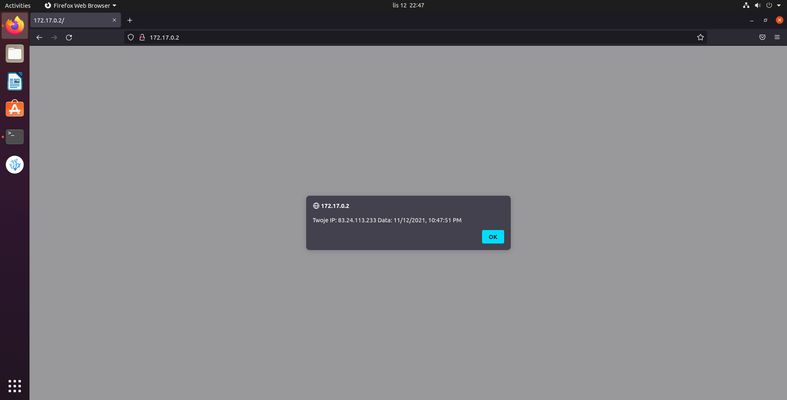

# 3
a. docker build -t test1 .  
b. docker run -it --name test test1  
c. docker exec -it test1 cat /var/www/localhost/htdocs/log.txt  
d. docker history test1  

# 4
"czy a jeśli tak to w jaki sposób można zbudować obraz wykorzystując bezpośrednia link do Dockerfile umieszczonego na GitHub"  
polecenie "docker build https://github.com/mst235234/zad1.git#master"  
"jak przenieść stworzony obraz na swoje konto na DockerHub"  
1. Budujemy obraz z githuba docker build https://github.com/mst235234/zad1.git#master -t "login/nazwaobrazu"  
2. Logujemy sie do dockerhuba: docker login  
3. Pushujemy: docker push login/nazwaobrazu  
